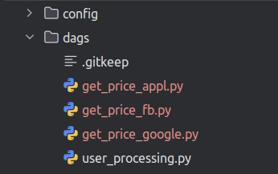
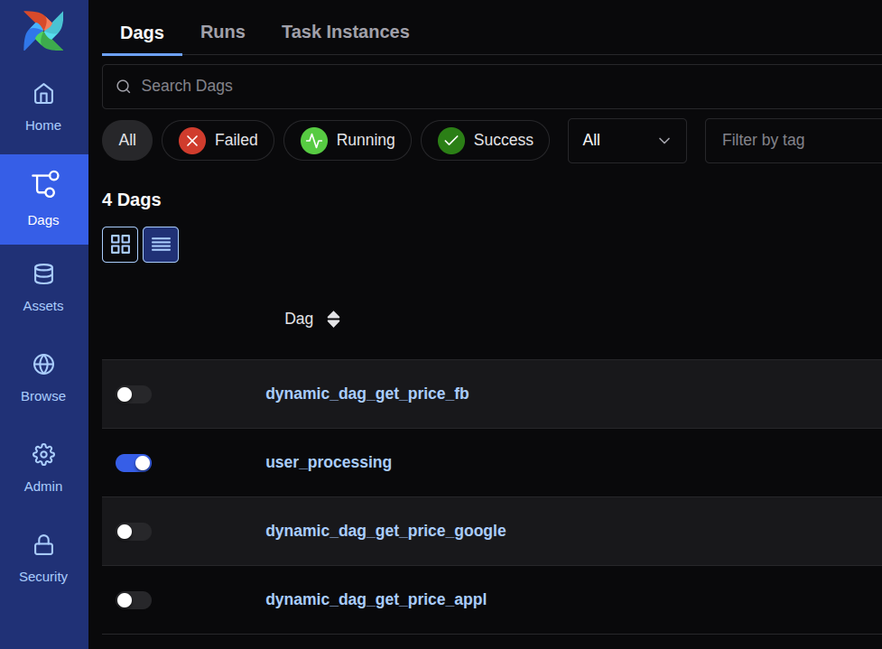

# Running Airflow in Docker  
https://airflow.apache.org/docs/apache-airflow/stable/howto/docker-compose/index.html 

# Initializing Environment  
https://airflow.apache.org/docs/apache-airflow/stable/howto/docker-compose/index.html#initializing-environment  

```shell
pip install -r requirements.txt
```

```sh
mkdir -p ./dags ./logs ./plugins ./config
echo -e "AIRFLOW_UID=$(id -u)" > .env
docker compose up
```


## Create database connection to PostgreSQL  
  


## Login to Airflow UI  

[http://localhost:8080](http://localhost:8080/auth/login/?next=http://localhost:8080/)  

```text
Login: airflow
Password: airflow
```


## Container airflow-schedler  
```sh
airflow

airflow tasks test user_processing create_table
airflow tasks test user_processing is_api_available
airflow tasks test user_processing extract_user
airflow tasks test user_processing process_user
```

## Dynamic DAGs  

### Configurattin .yaml files  
```text
imclude/
  ├── config_appl.yaml
  ├── config_fbl.yaml
  └── config_googl.yaml
  
```

### DAG template  
```text
dags/
  └── dag_template.jinja2
```

### Geneerating script
```text
dags/
  └── dag_generator.py
```

### Generate Dynamic DAGs  
```sh
# Makefile
make apply-dynamic-dag

# Python script
python include/scripts/dag_generator.py
```

## Generate dynamic DAGs  


### DAGs in Airflow UI



## Install additional dependencies into Docker containers for deelopment purposes  

```shell
_PIP_ADDITIONAL_REQUIREMENTS="pandas==2.0.0 scikit-learn==1.2.0" docker compose up
```
