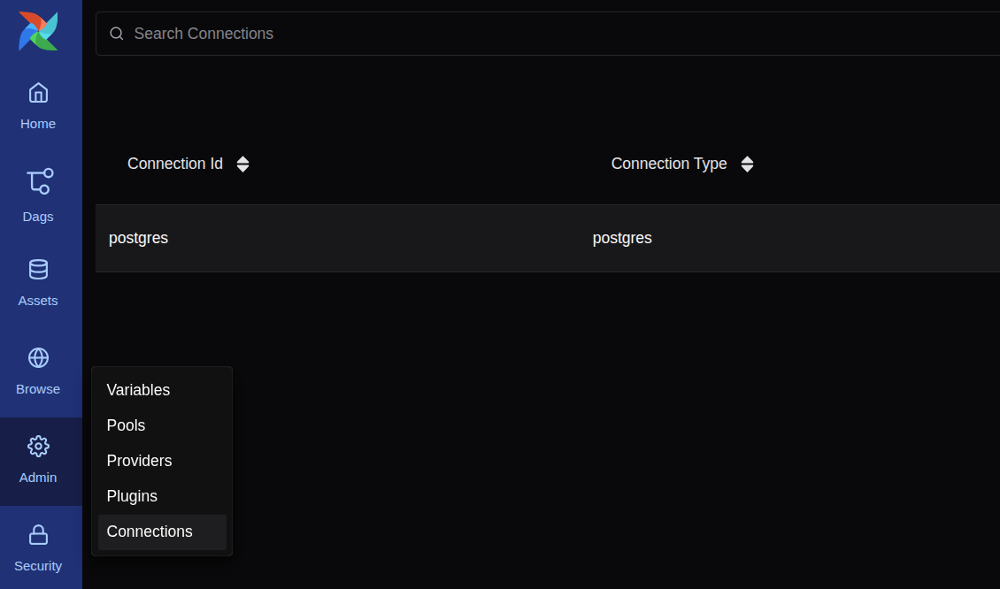
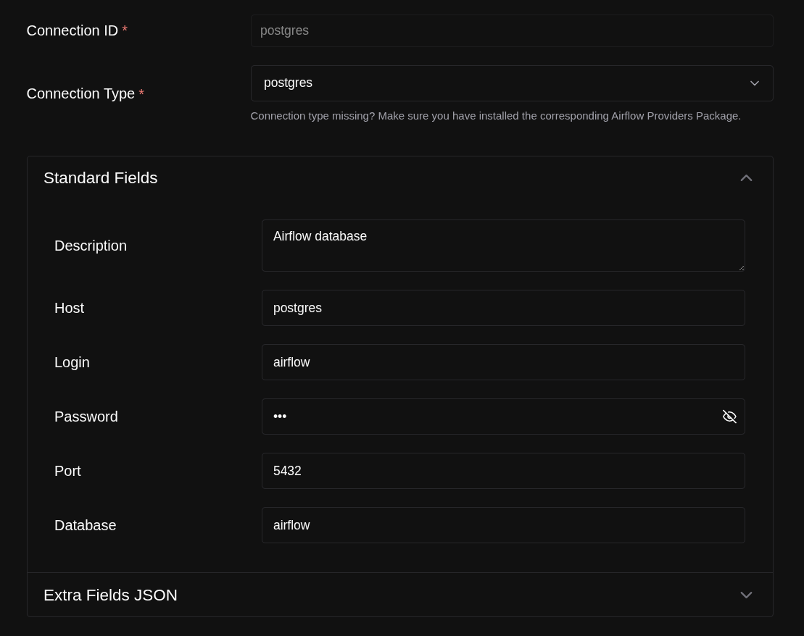
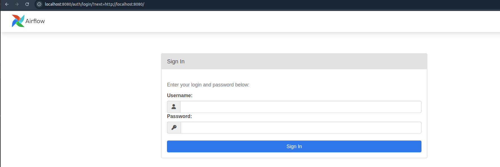
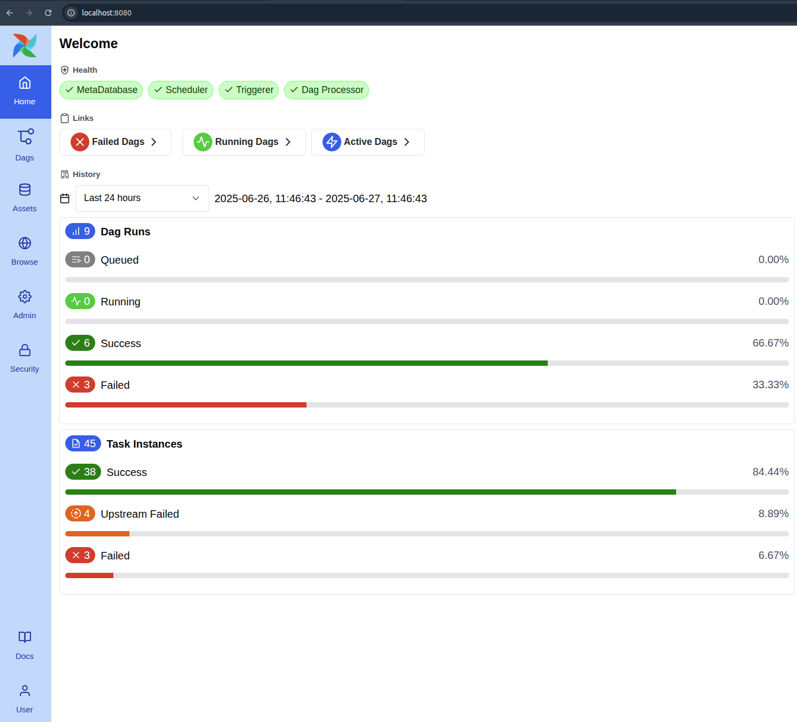

# Running Airflow in Docker  
https://airflow.apache.org/docs/apache-airflow/stable/howto/docker-compose/index.html 

# Initializing Environment  
https://airflow.apache.org/docs/apache-airflow/stable/howto/docker-compose/index.html#initializing-environment  

```shell
pip install -r requirements.txt
```

```sh
mkdir -p ./dags ./logs ./plugins ./config
echo -e "AIRFLOW_UID=$(id -u)" > .env
docker compose up
```


## Create database connection to PostgreSQL  
  




## Login to Airflow UI  

[http://localhost:8080](http://localhost:8080/auth/login/?next=http://localhost:8080/)  

```text
Login: airflow
Password: airflow
```





## Container airflow-schedler  
```sh
airflow

airflow tasks test user_processing create_table
airflow tasks test user_processing is_api_available
airflow tasks test user_processing extract_user
airflow tasks test user_processing process_user
```
